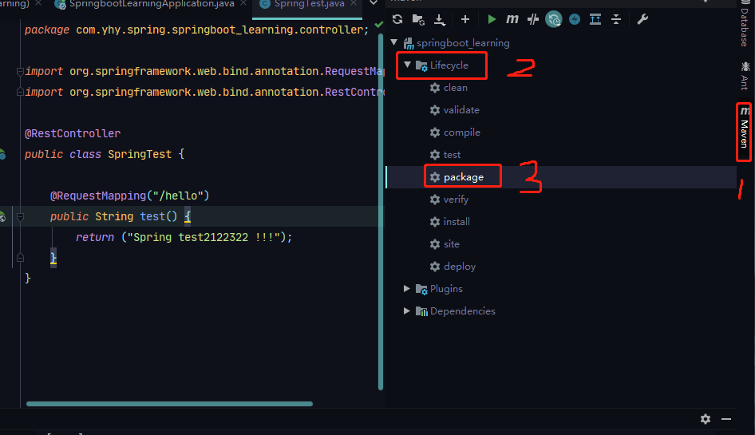
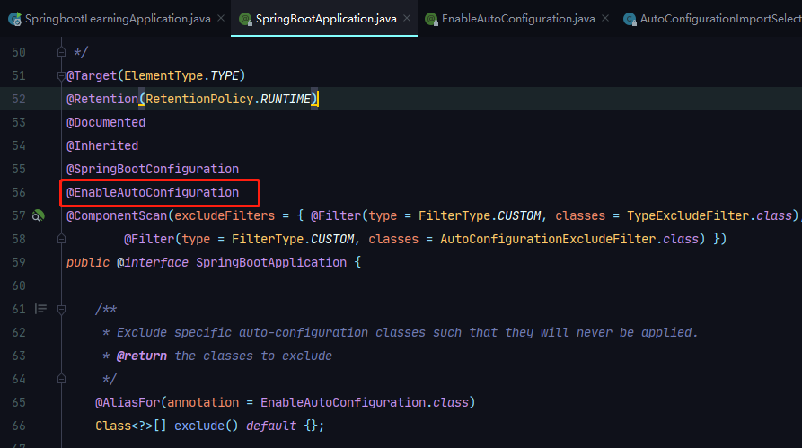
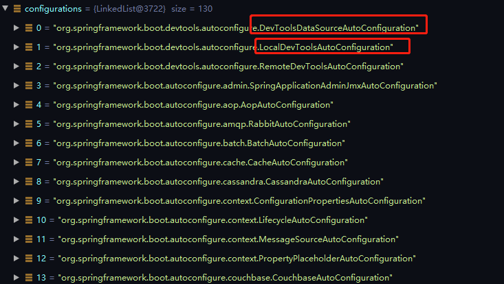
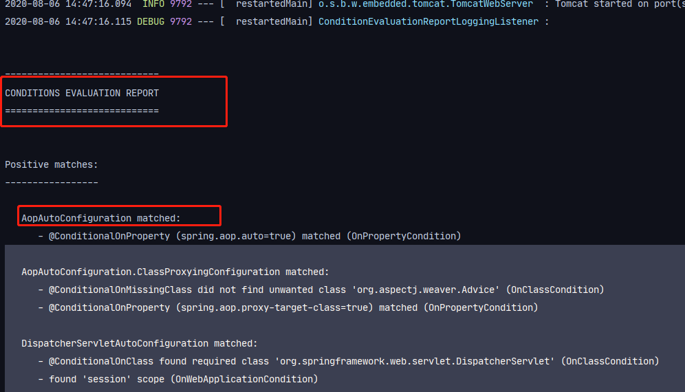
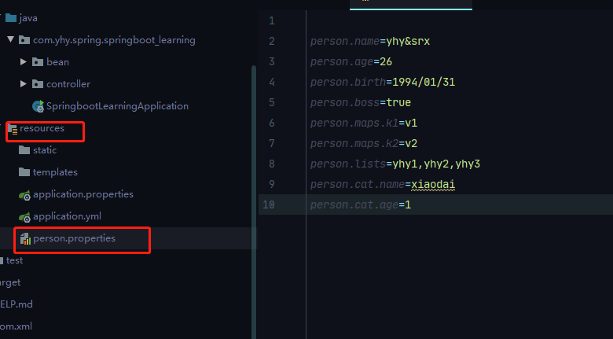
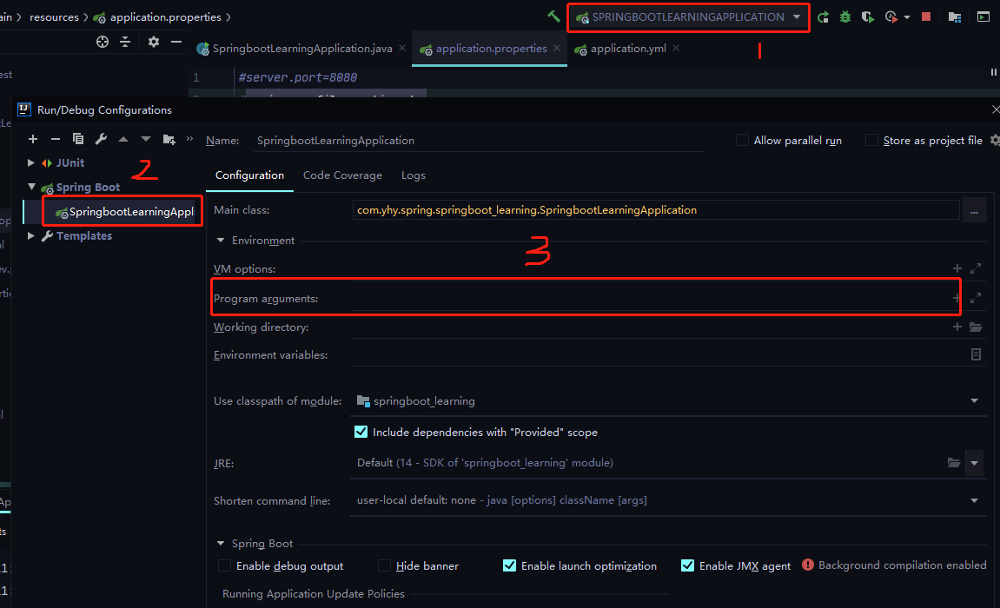
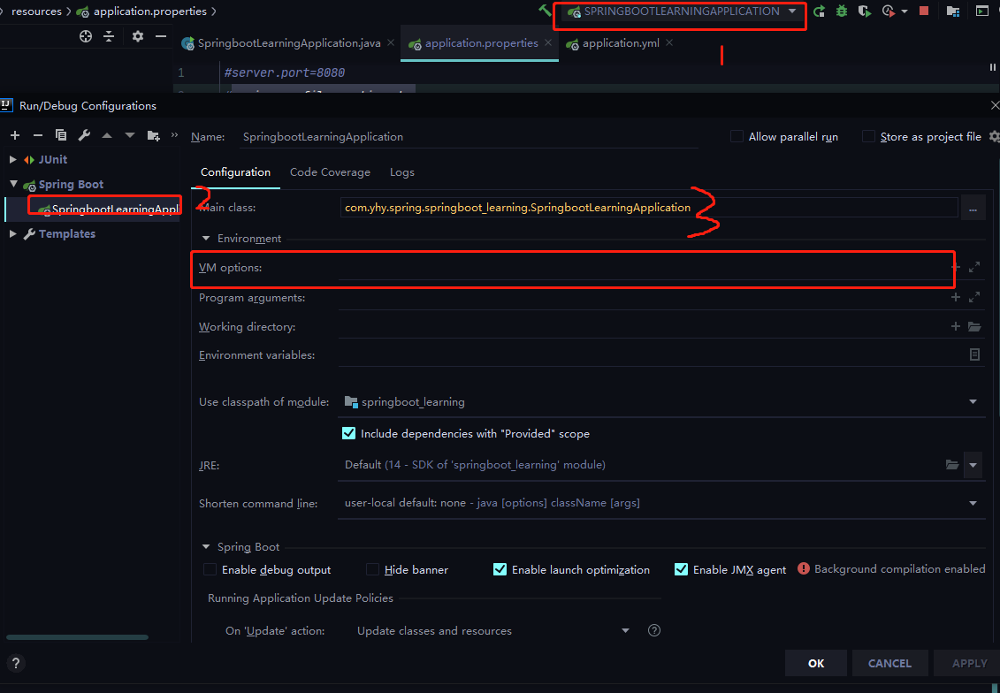
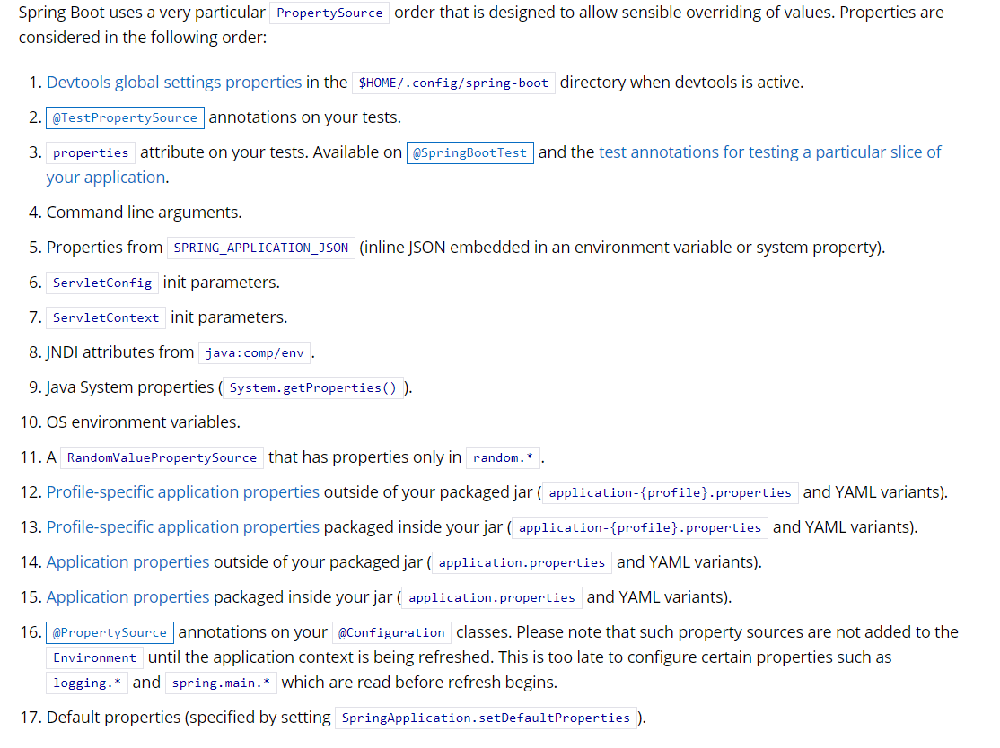

# SpringBoot 学习笔记

[TOC]

## 1. 默认扫描器 basebackage

在Spring中我们使用`<context:component-scan base-package="xx.yyy.zzz" />`或者`@ComponentScan`注解来配置默认默认扫描器basebackage， 在springboot中我们只需要将主启动类：例如SpringApplication.java放到想要扫描的包下， 那么springboot就会扫描这个包下面所有的类并纳入到spring IOC容器中。 通常放到root package下，主启动类上需要有`@SpringBootApplication`注解。

***

## 2. Spring boot热部署

- 先将spring boot需要的相关依赖copy到pom文件中

  ```xml
  <dependencies>
      <dependency>
          <groupId>org.springframework.boot</groupId>
          <artifactId>spring-boot-devtools</artifactId>
          <optional>true</optional>
      </dependency>
  </dependencies>
  ```

- 修改IDEA配置， File-settings-compiler-Build Project automatically 勾上

- 然后再IDEA中CTRL+SHIFT+ALT+/， 选择Registry, 勾上 Compiler autoMake allow....

- **一个神坑**： 按照上面的教程做了好多遍就是不好使， 后来才发现好像必须要debug模式下才会生效.... 1个小时的血泪史   

***

## 3. Spring boot 微服务

- 微服务是一种架构风格， 每一个应用都应该是一个小型的服务， 各个服务之间可以通过HTTP协议进行互通。 在这之前我们使用的事单体应用

- **单体应用**： ALL IN ONE应用， 所有的页面，代码和相关的静态资源都在一个应用中， 然后将应用打成WAR包统一上传部署。

  优点：

  - develop和test简单因为所有资源都在一起

  - deploy简单， 只需要把整个应用打成war包直接部署到Tomcat上

  - scale简单，当高并发发生时， 只需要将相同的应用复制到多个不同的server上，然后使用负载均衡机制来提高并发能力。

  缺点：

  - 牵一发动全身

- 每一个功能元素最终都是一个可独立替换和独立升级的软件单元

***

## 4. 简化部署springboot应用

在IDEA中，先找到右侧的maven 选项单， 点开之后选择我们的项目， 打开之后下面有

打包成功后去到相应的路径下找到这个包，然后copy这个包的路径，在cmd模式下进入到想用路径执行`java -jar xxxxxxx包名`的命令就可以运行这个项目了

Tomcat会在打包的时候直接被压缩到jar包里

***

## 5. Springboot启动细节探究

### 5.1 **POM文件**

- 导入了父项目

```xml
<parent>
        <groupId>org.springframework.boot</groupId>
        <artifactId>spring-boot-starter-parent</artifactId>
        <version>2.3.1.RELEASE</version>
        <relativePath/> <!-- lookup parent from repository -->
</parent>

parent又引用了spring-boot-dependencies
<parent>
    <groupId>org.springframework.boot</groupId>
    <artifactId>spring-boot-dependencies</artifactId>
    <version>2.3.1.RELEASE</version>
</parent>
 在spring-boot-dependencies中管理当前springboot版本中的所有依赖的版本version，springboot版本的仲裁中心
```

所以我们导入依赖时是不需要些版本号的，除了一些特定的没有在spring-boot-dependencies中声明的依赖需要我们自己写版本号

- 导入的依赖

````xml
 <dependency>
      <groupId>org.springframework.boot</groupId>
      <artifactId>spring-boot-starter-web</artifactId>
</dependency>
spring-boot-starter-web:场景启动器，包含了web模块所依赖的组件
````

Springboot将所有的功能场景都抽取了出来做成了不同的starter启动器，需要用哪个在pom文件中引用相关的启动器就可以.

### 5.2 **Springboot的启动细节详解**

#### 5.2.1 Springboot中启动相关的重要注解

- **@SpringBootApplication** 将这个注解标注在某一个类上，这个类就是整个application的主配置类，springboot就会运行这个类的main方法来运行整个应用

  ````java
  @Target({ElementType.TYPE})
  @Retention(RetentionPolicy.RUNTIME)
  @Documented
  @Inherited
  @SpringBootConfiguration
  @EnableAutoConfiguration
  @ComponentScan(
      excludeFilters = {@Filter(
      type = FilterType.CUSTOM,
      classes = {TypeExcludeFilter.class}
  ), @Filter(
      type = FilterType.CUSTOM,
      classes = {AutoConfigurationExcludeFilter.class}
  )}
  )
  public @interface SpringBootApplication {
  ````

- **SpringBootConfiguration** : springboot的配置类

  标注在某个类上表示这是springboot的配置类，这个注解里面包含了**@Configuration**注解，配置类也是容器中的一个组件component

- **EnableAutoConfiguration**: 开启自动配置的注解

  ````java
  @AutoConfigurationPackage
  @Import({AutoConfigurationImportSelector.class})
  public @interface EnableAutoConfiguration {
  ````

  **@AutoConfigurationPackage**: 自动配置需要扫描的包

  ​		在最新的springboot版本中，这个地方导入的是**@Import({Registrar.class})**这个注解，@Import是spring的底层注解，向当前组件中导入目标组件

  ==这个注解的最终作用就是将主配置类（**@SpringBootApplication**标注的类 ）的所在包和其包下所有的子包里面的所有组件扫描到spring容器中==

- **@Import({AutoConfigurationImportSelector.class})**

  将需要导入的组件以全类名的方式添加到容器中，给容器中导入非常多的自动配置类，这些配置类可以免去我们自己手动编写配置注入组件等的工作，下图的这些自动配置类都是从**META-INF/spring.factories**中读取的**EnableAutoConfiguration**的值

- **@RestController**注解

  这个注解就是**@ResponseBody**和**@Controller**注解的合体


#### 5.2.2 自动配置的原理

##### 5.2.2.1 **@SpringBootApplication**

服务器启动时先去加载主配置类，主配置类的注解**@SpringBootApplication**中包含了一个重要的自动配置注解**@EnableAutoConfiguration**



##### 5.2.2.2 **@EnableAutoConfiguration**

作用：利用**AutoConfigurationImportSelector**给容器中导入组件

- 在**AutoConfigurationImportSelector**中，首先需要查看**selectImports**方法

  

- 在**getAutoConfigurationEntry**方法中，主要是返回**configurations**--包含了所有需要导入的组件

  

- **getCandidateConfigurations**方法的作用是为了加载**FactoryNames**

  

  

- 在**loadSpringFactories**中我们会在springboot帮我们导入的jar包类的路径下的"META-INF/spring.factories"去寻找资源

  

  

  然后将扫描到的文件内容包装成Properties对象，然后从Properties对象中获取到``EnableAutoConfiguration.class``(类名)的值，然后将获取到的值添加到容器中

  

综上，**@EnableAutoConfiguration**注解就是将jar包中**META-INF/spring.factories**配置的所有EnableAutoConfiguration的值都加在到容器中


上图中的每一个XXXAutoConfiguration都是容器中的一个组件，加入到容器中后用来做自动配置

-----

##### 5.2.2.3 HttpEncodingAutoConfiguration 自动配置注解及流程详解

以**HttpEncodingAutoConfiguration（HTTP编码自动配置）**为例解释自动配置的原理: 就是走一遍上面的流程

````java
 //表示这个是配置类，给容器中添加组件
@Configuration(proxyBeanMethods = false)

//启用指定类的ConfigurationProperties功能，看下图的代码
//将配置文件中对应的值和ServerProperties绑定起来，并把ServerProperties加入到容器
@EnableConfigurationProperties(ServerProperties.class)

//Spring底层@Conditional注解：根据指定的条件进行判断，如果满足条件配置类的配置才生效
//所以下面的直接就是判断应用是否是web应用
@ConditionalOnWebApplication(type = ConditionalOnWebApplication.Type.SERVLET)

//下面注解用来判断当前项目是否包含CharacterEncodingFilter.class
//CharacterEncodingFilter.class：SpringMVC中解决乱码的拦截器
@ConditionalOnClass(CharacterEncodingFilter.class)

//判断配置文件中是否存在某个配置--server.servlet.encoding.enabled,
//matchIfMissing = true 即使配置文件中不存在这个属性，也是默认生效的
//在配置文件中使用对应的encoding属性时必须是server.servlet.encoding.xxx
@ConditionalOnProperty(prefix = "server.servlet.encoding", value = "enabled", matchIfMissing = true)

public class HttpEncodingAutoConfiguration {
    //和Springboot配置文件进行映射
    private final Encoding properties;

    //只有一个有参构造器，参数的值直接从容器中拿
    //(因为@EnableConfigurationProperties(ServerProperties.class)
    //已经将值加到了容器中)
	public HttpEncodingAutoConfiguration(ServerProperties properties) {
		this.properties = properties.getServlet().getEncoding();
	}
    
    @Bean
	@ConditionalOnMissingBean
	public CharacterEncodingFilter characterEncodingFilter() {
		CharacterEncodingFilter filter = new OrderedCharacterEncodingFilter();
		filter.setEncoding(this.properties.getCharset().name());
		filter.setForceRequestEncoding(this.properties.shouldForce(Encoding.Type.REQUEST));
		filter.setForceResponseEncoding(this.properties.shouldForce(Encoding.Type.RESPONSE));
		return filter;
	}
    
    
Note:
    所以只要上述的直接全部生效，这个配置类就生效
````

所有在配置文件中可以使用的属性，都是在下面的这种XXXXProperties的文件中定义的

````java
/**
* 这个注解对应上面代码的 @EnableConfigurationProperties(ServerProperties.class)
 用来从配置文件中读取指定的值和bean的属性进行绑定
*/
@ConfigurationProperties(prefix = "server", ignoreUnknownFields = true)
public class ServerProperties {

	/**
	 * Server HTTP port.
	 */
	private Integer port;
    
    /**
	 * Network address to which the server should bind.
	 */
	private InetAddress address;
````

综上：配置文件中能使用的配置都是来自于对应的XXXXProperties类，配置文件中使用的属性一定是以``@ConditionalOnProperty(prefix = "server.servlet.encoding", value = "enabled", matchIfMissing = true)``中的prefix开头

````xml
server.servlet.encoding.xxxx=xxxx
````

==这一小节写的很乱，自己也是反复看了源码好久才大概理解，大家就凑合着看吧。。。==

##### 5.2.2.4 debug模式下观察自动配置是否生效

要想知道哪些自动配置生效了， 哪些没生效， 在application.properties中加入``debug=true``即可打印出对应的配置类信息



***

 ## 6. Sprintboot的相关配置及配置文件

### 6.1 **application.properties** (名字是固定的)

这个文件是springboot应用的源文件， 在resources文件夹下面，一切都是默认配置。 我们可以通过它来修改一些应用的配置，例如修改本地Tomcat端口号， 可以加上`server.port=8081`

### 6.2 **application.yml **(名字是固定的)

yml是YAML(YAML Ain't Markup Language)语言的文件，以数据为中心，比json、xml更适合做配置文件。语法和在**application.properties**中不一样， 以修改端口为例

````yml
server.port=8081---application.properties
--------------------------------------
server:
	port:8081   -----application.yml
````

#### 6.2.1 **YAML的基本语法**

- Key: Value 来表示一对键值对（key和value之间必须有空格）

  以空格的缩进来控制层级关系，只要左对齐的都是同一层级，==注意不能用TAB==

  ``````yaml
  server:
      port: 8081
      path: /hello
  ``````

  属性和值大小写敏感

- 值的写法：

  **基本类型：数字，字符串，布尔值**

  key: value 直接写相应的值就行；

  - 字符串默认不用加单引号或双引号

    双引号“ ”：会将特殊字符换成对应的转义格式

    `````yaml
    name: "testString \n test"
    输出的结果是：
    testString
    test
    `````

    单引号‘ ’：回转义特殊字符

    ````yaml
    name: "testString \n test"
    输出的结果是：
    "testString \n test"
    ````

  - **对象，Map等类型（属性和值）使用键值对形式**

    对象： 依旧是Key: value格式

    ````yaml
    friends:
        lastName: yhy ----对象的属性，注意缩进
        age: 20
    
    上述的代码可以写在一行里--行内写法
    friends: {lastName: yhy,age: 20}
    ````

  - **数组（List,set）**

    用''-''表示数组中的一个元素

    ````yaml
    pets:
        - cat
        - dog
        - pig
    行内写法
    pets: [cat,dog,pig]
    ````

#### 6.2.2 **如何在指定的class内获取yml配置文件的值**

yml模板

````yaml
Person:
  name: yhy
  age: 26
  boss: true
  birth: 1994/01/31
  maps: {k1: v1,k2: v2}
  lists:
    - yhy1
    - yhy2
    - yhy3
  cat:
    name: xiaodai
    age: 1
 
````

对应的java bean写法

````java
/**
* @ConfigurationProperties-本类中的所有属性和配置文件相关配置进行绑定--下面的组件必* 须要在spring容器中才能够生效,所以要加上@Component注解

* Note:@ConfigurationProperties默认从全局配置文件中取值，如果需要指定配置文件要使
* 用@PropertySource
*/
@ConfigurationProperties(prefix = "person")
@Component
public class Person {

    private String name;
    private Integer age;
    private Boolean Boss;
    private Date birth;

    private Map<String, Object> maps;
    private List<Object> lists;
    private Cat cat;
    ----加上 getter /setter 和 toString方法
````

#### 6.2.3 **将yaml中的代码改写在application.properties中**

````xml
person.name=yhy
person.age=26
person.birth=1994/01/31
person.boss=true
person.maps.k1=v1
person.maps.k2=v2
person.lists=yhy1,yhy2,yhy3
person.cat.name=xiaodai
person.cat.age=1
````

#### 6.2.4 **什么时候使用@Value或@ConfigurationProperties，有什么区别**

如果我们不想用上面6.2.2中的的@ConfigurationProperties(prefix = "person")来取配置文件中的值，可以使用Spring中原始的@Value来进行取值，例子如下

````java
@Component
public class Person {

    @Value("${person.name}") //从配置文件中读取对应的值
    private String name;
    @Value("#{13*2}")  //使用计算的方式得出结果
    private Integer age;
    @Value("true")
    private Boolean Boss;
    @Value("${person.birth}") //从配置文件中读取对应的值
    private Date birth;

    //@Values不支持复杂数据类型的封装
    private Map<String, Object> maps;
    private List<Object> lists;
    private Cat cat;
````

#### 

|                | @ConfigurationProperties                 | @Value           |
| -------------- | ---------------------------------------- | ---------------- |
| 功能           | 可以批量注入配置文件中的属性到bean中     | 需要一个个的注入 |
| 松散绑定语法   | 支持（例如lastName可以写成last-name）    | 不支持，必须匹配 |
| SpEL           | 不支持（eg:#{13*2}写在配置文件中不工作） | 支持             |
| JSR303数据校验 | 支持(eg: 使用@Email等注解限制数据)       | 不支持           |
| 复杂数据类型   | 支持                                     | 不支持           |

综上所述，如果只是取某一个固定的基础变量的值，可以直接使用**@Values**注解； 如果需要获取大量配置文件的值并映射到bean中，最好使用**@ConfigurationProperties**注解； 也可以两个注解一起使用

### 6.3 **@PropertySource**注解和**@ImportSource**注解的使用

#### 6.3.1 **@PropertySource**：加载指定的配置文件

我们不可能把所有的配置信息都放在全局配置文件中，如果我们想要将部分信息提取出来放在我们自定义的文件中，可以使用这个注解进行读取。例如我们新建一个person.properties配置文件然后将上面的配置信息cut到这个文件中

然后对java类就行修改

````java
@PropertySource("classpath:person.properties")
@ConfigurationProperties(prefix = "person")
@Component
public class Person {

    private String name;
    private Integer age;
    private Boolean Boss;
    private Date birth;

    private Map<String, Object> maps;
    private List<Object> lists;
    private Cat cat;
````

#### 6.3.2 **@ImportSource**： 导入Spring的配置文件，让相应配置文件生效

一些旧项目可能既包含springboot注解类和一些spring相关的xml配置类，如果想让xml配置类生效，就要将这些xml使用**@ImportSource**导入进来

一般将**@ImportSource**注解放在主配置类上，使用方法如下：

````java
//这个注解可以添加多个配置文件到当前application中
@ImportResource(locations = {"classpath:xx1.xml", "classpath:xx2.xml"})
@SpringBootApplication
public class SpringbootLearningApplication {

    public static void main(String[] args) {
        SpringApplication.run(SpringbootLearningApplication.class, args);
    }
}
````

但是上述的做法太过于麻烦因为我们不想再使用传统的spring xml配置文件，**springboot推荐给容器中添加组件的做法是使用全注解方式**

1. 编写配置类并将相应的组件写到配置类中
2. 然后使用@Bean添加组件到容器中

````java
/*
 * @Configuration:  告诉springboot这是一个配置类,替换spring的配置文件
 */
@Configuration
public class ApplicationConfig {

    @Bean //将方法的返回值添加到spring容器中， 容器中组件的默认id就是方法名
    public HelloService helloService() {
        return new HelloService();
    }
}
````

### 6.4 配置文件占位符

很简单，就是使用${}表达式然后放在配置文件中， 和JSP中的参数赋值差不多。

例如生成**随机数**

````xml
person.name=yhy${random.uuid} ---在后面生成随机的uuid
person.age=${random.int}  --随机生成整数person.name=yhy
person.birth=1994/01/31

person.cat.name=${person.name}_xiaodai
person.cat.age=${person.catAge:2} //冒号后面的值是自定义的默认值
````

上面的**person.cat.name**会自动找到对应的**${person.name}**值然后再拼接后面的字符串，如果​{person.name}值找不到系统会报错，因为我们在person的java类中定义了name属性

**person.cat.age**: ${person.catAge:20}这个值就算找不到也不会报错，因为java实体类中并没有catAge属性，如果找不到这个值就使用我们自定义的默认值：2

### <a name="开发环境切换">6.5 **Springboot中的Profile/开发环境的切换**</a>

**Profile**可以用来灵活切换环境的，例如在大型项目中我们可能有开发环境，qa测试环境，prod环境等等。每个环境对应的endpoint可能都会发生改变，我们可以使用prifile进行统一管理和快速切换。

下面介绍一下使用**Profile**的三种方式

#### 6.5.1 **多Profile文件的方式**

在配置主配置文件的时候，我们可以将配置文件名改为application-{profile}.properties/yml


如上我创建了两个不同的配置文件，一个是默认的application.properties文件，一个是application-dev.properties开发环境配置文件。

此时开启服务器默认还是使用application.properties配置文件的端口8080

如果想切换到dev环境只需要在主配置文件application.properties中加上下面的代码

````xml
spring.profiles.active=dev ---dev是你配置文件自定义的后缀名字
````

此时再启动服务器端口就会被切换到8081

#### 6.5.2 **yml多文档块方式**

在yml文件中切换配置文件，可以使用下面的语法

````yaml
server:
  port: 8080
spring:
  profiles:
    active: prod
---
server:
  port: 8081
spring:
  profiles: dev
---
server:
  port: 8082
spring:
  profiles: prod
````

上述的``---``是用来分割文档块的， 每一个文档块都可以当做一个新的yml文件使用

此时如果不指定spring.profiles.active的值，则默认使用最上面的默认配置8080端口，指定明确的值就会切换到对应的yml文档块中，如上代码服务启动端口号为8082

#### 6.5.3 **如何在命令行中激活指定profile**

1. `java -jar xxxxxxx --spring.profiles.active=dev`只需要在部署后的包路径下执行的命令后面加上`--spring.profiles.active=xxx`即可

2. 若是在IDE中进行测试可以不用进行打包，直接在program argument中添加`--spring.profiles.active=xxx`也可以

   

3. 在虚拟机参数中进行修改也可以

   

   在VM option中写入-Dspring.profiles.active=xxx`。-Dxxx是固定写法不可修改

### 6.6 配置文件的加载位置和加载顺序

Springboot启动时会扫描以下位置的application.properties或者application.yml文件作为默认配置文件：

- 文件路径下:./config/
- 文件路径下:./
- 类路径下(在IDEA中就是resources folder)：./config/
- 类路径下:./

以上是按照==优先级从高到低==的顺序进行加载， 高优先级的配置文件内容会覆盖低优先级的内容


这四个不同的配置的配置文件可以**互补共存**，我们可以在不同层级的配置文件中配置不同的属性进行使用

#### 6.6.1 改变默认的配置文件位置

直接在当前的配置文件中使用```spring.config.location=xxx``是不会生效的。在项目打包好之后，使用命令行参数的形式在启动时指定配置文件的新位置：

指定的配置文件和默认加载的文件会共存：**互补位置**

``java -jar xxxx.jar --spring.config.location=xxxx``


### 6.7 外部配置加载顺序

Springboot官方文档提供了17个外部配置(springboot 2.3.3)：==优先级从高到低==：高优先级覆盖低优先级，不同内容的配置==会共存==

想要了解详情可以直接去官方文档进行查看: [官方文档](https://docs.spring.io/spring-boot/docs/2.3.3.BUILD-SNAPSHOT/reference/html/spring-boot-features.html#boot-features-external-config)

#### 6.7.1 常用的场景

1. **命令行参数**--对应上面第3条

   例如已经打包好的项目，如果我们想要修改启动端口号却不想花时间修改配置文件，可以直接在启动时使用命令行参数 

   ``java -jar xxx.jar --server.port=8083`` 多个配置用空格分隔： --配置项=值

2. **JNDI系统属性**--对应上面第8条

3. **Java系统属性**--对应上面第9条

4. **RandomValuePropertySource**配置的**random.***属性--对应上面第11条

   

  **优先加载带profile的配置文件**--==从jar包外向jar包内进行寻找== --对应上面第12-13条

5. jar包外部的application-==(profile)==.properties或者==带profile的==application.yaml配置文件

6. jar包内部的application-==(profile)==.properties或者==带profile的==application.yaml配置文件

 

  **再加载不带profile的配置文件**--==从jar包外向jar包内进行寻找==--对应上面第14-15条

7. jar包外部的application.properties或者==不带profile的==application.yaml配置文件

8. jar包内部的application.properties或者==不带profile的==application.yaml配置文件

 ```xml
Note: 很多人不懂jar包内外的含义是什么，我们打包时会将类路径下的配置文件生成到jar包中，但是如果有大量配置需要更改，我们可以在和jar包同级的文件夹下面再创建一个application.properties，此时Springboot会默认先加载外部的这个配置文件去覆盖内部的重复配置
 ```

#### 6.7.2 配置文件中都有哪些属性可以使用

上面提到了很多在application.properties中可以使用的属性，例如server.port, spring.profiles.active等等. 那么具体都有哪些属性可以使用可以直接参考官方文档中的属性列表：[配置文件属性官方文档](https://docs.spring.io/spring-boot/docs/2.3.3.BUILD-SNAPSHOT/reference/html/appendix-application-properties.html#server-properties)

------

## 7. Springboot&&日志

### 7.1 市面上常用的日志框架

Jboss-logging， slf4j，log4j, log4j2, logback

Spring boot使用的是**slf4j（抽象层）**和**logback(实现类)**

### 7.2 Slf4j使用

#### 7.2.1 如何在系统中使用Slf4j

在使用日志方法的调用应该先去调用日志的抽象层里面的方法，而不是直接调用实现类的方法

给系统内倒入slf4j的jar包和logback的jar包

````java
import org.slf4j.Logger;
import org.slf4j.LoggerFactory;

public class HelloWorld {
  public static void main(String[] args) {
    Logger logger = LoggerFactory.getLogger(HelloWorld.class);
    logger.info("Hello World");
  }
}
````


使用slf4j之后，日志的配置文件还是要根据**具体的实现框架来生成**

#### 7.2.2 不同的日志框架统一转换成slf4j

假设我们的Application使用的是(slf4j+logback), Spring(Commons-logging), Hibernate(jBoss-logging)等等

我们需要统一日志记录，即便是别的框架但是我们也让它使用logback进行输出，这样只需要写一个日志配置文件即可

<a name="slf4j"></a>

如上slf4j适配图所示：**统一使用slf4j的步骤如下**

==1.首先将系统中其他日志框架先排除==

==2.然后用中间包来替换排除掉的框架jar包==

==3.再来导入slf4j自己的实现==

### 7.3 Springboot日志关系

Springboot中使用下面的依赖来加载日志功能

```xml
<dependency>
      <groupId>org.springframework.boot</groupId>
      <artifactId>spring-boot-starter-logging</artifactId>
      <version>2.3.1.RELEASE</version>
      <scope>compile</scope>
</dependency>
```


如上图所示，Springboot把log4j和jul都转换成了slf4j，然后最后使用相应的实现框架进行实现

==Note:在使用Springboot引用新日志框架时，一定要将原有的日志框架移除然后倒入对应的替换包才可以进行使用，否则会出现jar包冲突==

### 7.4 Springboot中的日志默认配置

````java
Logger logger = LoggerFactory.getLogger(getClass());

    @Test
    void contextLoads() {
        //以下是日志的级别，由低到高排序 trace<debug<info<warn<error
        logger.trace("it is tract.....");
        logger.debug("it is debug.....");
        //Springboot的默认级别是info,所以只打印info及其以上级别的日志信息
        //若想修改默认级别，可以在application.properties中修改，如下面代码示例
        logger.info("it is info.....");
        logger.warn("it is warn.....");
        logger.error("it is error.....");
    }
````

````xml
logging.level.root=trace //root可以换成对应的package路径，指定特定的需要日志扫描的包

logging.file=xxx.log //不指定路径：在当前项目路径下生成指定的log文件
			=G:/log/xxx.log //指定路径:在对应的路径下面生成log文件

logging.path=/spring/log //在当前项目所在磁盘的根路径下生产spring/log文件夹，并且生成						  //对应的spring.log文件(这个文件名是默认的)

Note:logging.file和logging.path是冲突的，一般使用其中之一就可以了，个人感觉logging.file更简单明了


<!-- 
	日志格式参数：
		%d 表示日期时间
		%thread 表示线程名
		%-5level 表示从左开始显示level等级的5个字符长度
		%logger{50} logger的名字最长50个字符，否则按照句点分隔
		%msg 日志具体消息
		%n 换行
-->
//控制台输出的日志格式
logging.pattern.console= %d{yyyy-MM-dd HH:mm:ss.SSS}  [%thread] %-5level %logger{50} - %msg%n

//文件中输出的日志格式
logging.pattern.console= %d{yyyy-MM-dd HH:mm:ss.SSS}  [%thread] %-5level %logger{50} - %msg%n
````

### 7.5 自定义日志配置文件

在类路径下放上每个框架自己的配置文件即可，springboot会优先去加载这些特定名字的配置文件而不是默认配置


**logback.xml**： 如果使用的是**logback.xml**, 日志框架会直接识别这个自定义的配置文件，**不需要通过Springboot框架**

**logback-spring.xml**： 日志框架不会直接加载这个日志配置文件，由springBoot框架去加载--必要带`-spring`后缀才能使用 **springProfile**高级功能

````xml
<springProfile name="staging">
    <!-- configuration to be enabled when the "staging" profile is active -->
</springProfile>

<springProfile name="dev | staging">
    <!-- configuration to be enabled when the "dev" or "staging" profiles are active -->
</springProfile>

<springProfile name="!production">
    <!-- configuration to be enabled when the "production" profile is not active -->
</springProfile>
````

如上所示配置可以在**logback-spring.xml**中来指定不同开发环境下的配置，例如日志的输出格式等等。开发环境的切换看[章节6.5 开发环境切换](#开发环境切换)

### 7.6 切换日志框架

可以按照slf4j的[日志适配图](#slf4j)进行相关的切换, 移除本身的jar包然后使用对应的替换包引入即可


---

## 8. Springboot&&Web开发